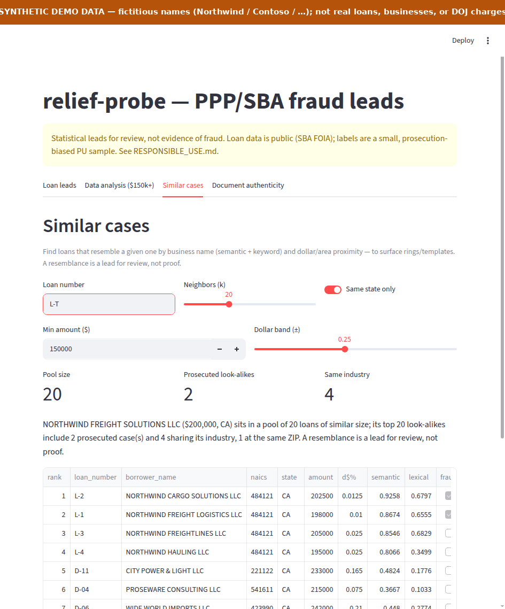
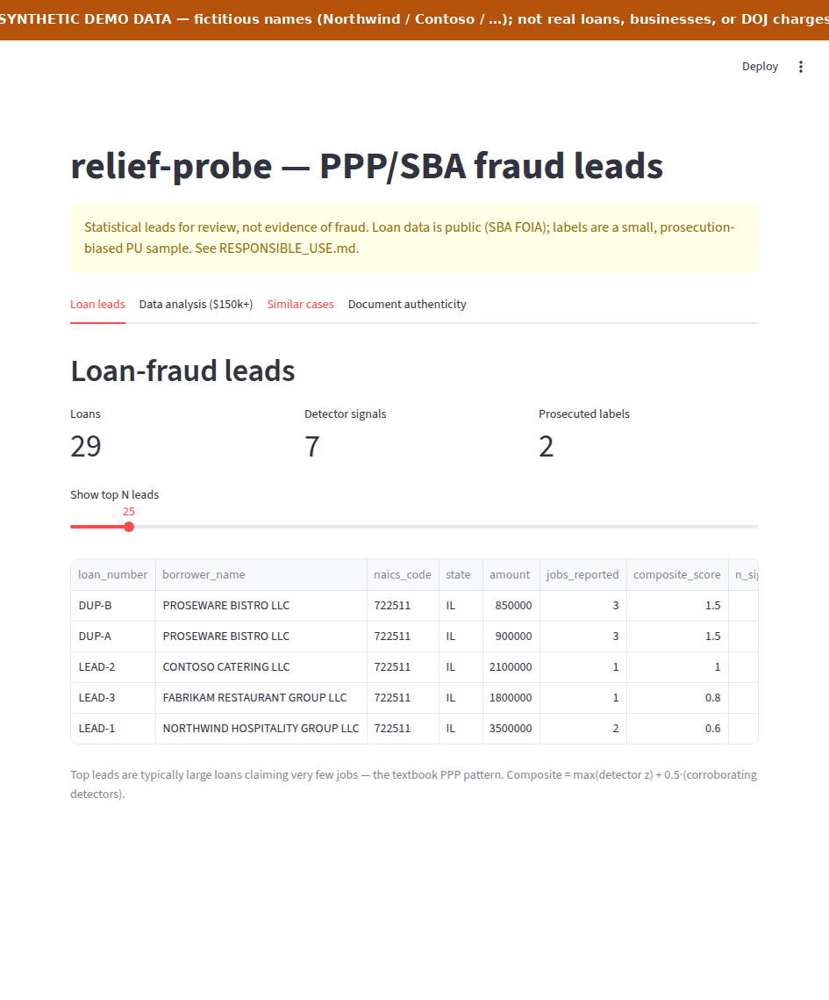
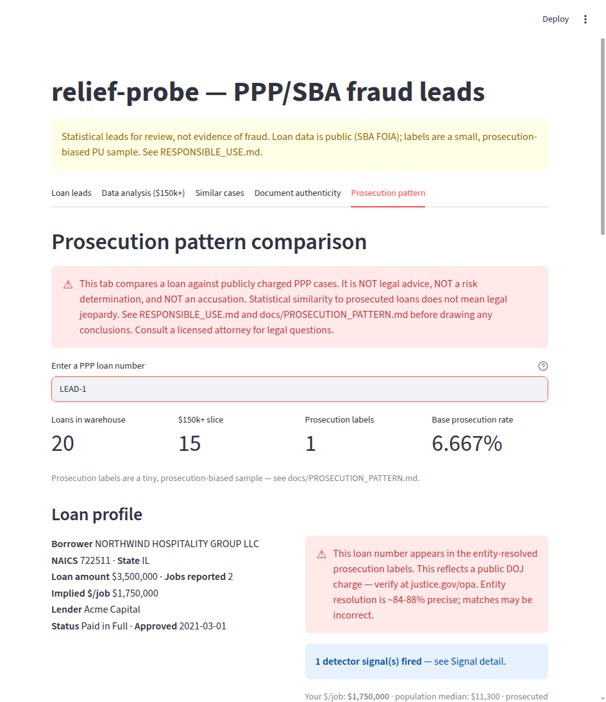

# relief-probe

[](https://github.com/owgreen-dev/relief-probe/actions/workflows/test.yml)

[](LICENSE)

[](https://relief-probe-git.streamlit.app/)

**Finding fraud leads in 11.4M public PPP loans — validated against *real, future* DOJ prosecutions, and honest about what works and what doesn't.**

Reproducible by a stranger from public federal files (SBA FOIA loan data + DOJ/SBA-OIG enforcement records), on a laptop, against a local DuckDB warehouse — no cluster.

<p align="center">
  <a href="https://relief-probe-git.streamlit.app/"></a>
</p>
<p align="center">
  <a href="https://relief-probe-git.streamlit.app/"><strong>▶ Try the live demo</strong></a> &nbsp;·&nbsp; interactive, on synthetic data only &nbsp;·&nbsp; or run it <a href="#usage">locally</a>
</p>

*The dashboard's "Similar cases" tab — shown on **synthetic demo data** (fictitious sample-company names). Given a loan, find its look-alikes by business-name + dollar + area similarity, surfacing a coordinated ring and flagging which neighbors are already prosecuted. A resemblance is a lead for review, not proof. (On the real warehouse, prosecuted loans' nearest look-alikes are ~3.4× enriched for fraud — see Results.)*

> **Research/educational project — not legal, financial, or investigative advice, and not an accusation of fraud against any person or business.** Every score is a *statistical lead for review of public data*, never a determination of guilt; all examples and screenshots use anonymized or synthetic data. See [RESPONSIBLE_USE.md](RESPONSIBLE_USE.md).

**Start here:** [Results one-pager](RESULTS.md) · [What it is](#what-it-is) · [Responsible use](RESPONSIBLE_USE.md)

## What it is

A program-integrity pipeline that ranks PPP loans by fraud-risk anomalies, **measures whether those rankings actually concentrate prosecuted fraud** (out-of-time — the DOJ charges post-date every loan), and layers LLM / graph / retrieval tools on top — each one built, validated on real labels, and **kept or killed on the evidence**.

The differentiator isn't a single model — it's the **discipline**. Every method is stress-tested against dumb baselines and a small, prosecution-biased positive-unlabeled (PU) label set, and the **negatives are reported, not hidden.** *PU because the 11.4M unprosecuted loans are **unlabeled, not innocent** — the naive-supervised trap is scoring "not yet charged" as "legitimate," and the whole evaluation is built to avoid it.* The repeated finding:

> **AI/ML here wins at _retrieval_ — finding look-alikes, recovering labels, expanding from a known lead — and *mostly* not at _prediction_ over a loan's own fields,** because prosecuted loans look plausible individually. *(Honest exception: a LightGBM over the full metadata union does beat the composite — but partly by learning lender/geo enforcement patterns. See [Results](docs/RESULTS.md).)*

## Results at a glance

**Does the ranking find prosecuted fraud?** On the labelable 965k-loan **$150k+ slice** (base rate 0.034%), the composite ranking lifts prosecuted loans **23.8× at k=500** — with honest **95% bootstrap CIs** (the eye-catching @100 number rests on *3 loans* and its CI spans zero; the README says so). And it barely beats a one-line `ORDER BY amount/jobs DESC` sort — so the *ratio* is the signal, not the machinery. That self-critique is the point.

**The "add AI" experiment, scored honestly — three retrieval wins, five prediction negatives, and one qualified prediction win:**

| Bucket | Outcome |
| --- | --- |
| **Prediction / cold-ranking** (re-score a loan's own fields) | LLM plausibility judge ❌ · name↔NAICS embedding mismatch ❌ · PU-bagging learned scorer ❌ *(overfit, caught by the holdout)* · **LightGBM learned scorer ⚠️ qualified win** *(~2× composite recall@5000 on the >2023 holdout, CI-backed — but partly learns lender/geo enforcement patterns; exploratory)* · graph ring cold-rank ❌ · business-recency ~❌ |
| **Retrieval / expansion** (bring new info, exploit relationships) | LLM entity resolution ✅ **+79 labels (+24%)** · similar-case homophily ✅ **3.4×** · graph lead-expansion ✅ |

Full per-method verdicts, written for a reader: **[docs/RESULTS.md](docs/RESULTS.md)** (the blow-by-blow engineering log is [docs/NEXT_STEPS.md](docs/NEXT_STEPS.md)).

### Two rankers, one default

So which is "the" ranking? There are two, for two different jobs — and every headline number names which:

- **Composite — the default.** Three unsupervised detectors, percentile-combined. **Transparent** (every lead explains itself: dollars-per-job, payroll-cap, duplicate funding), **label-free**, and unbiased toward enforcement patterns. The ranking you'd defend to an auditor.
- **LightGBM learned scorer — opt-in, exploratory.** A PU model over the *full* signal union. **~2× the composite's recall** on the >2023 holdout (CI-backed) — but not per-loan explainable, and partly learning *where enforcement looks* (lender/geo). A power tool with an asterisk; **never the default**, never in the production composite.

They're complementary, not competing: the transparent baseline is the headline; the learned scorer is the higher-recall option; and an **RRF consensus** of the two (loans both rank high) is the highest-confidence tier. The discipline is that the *default* stays explainable and label-free — the prosecution-biased model is opt-in, by design.

## Architecture

Layers mirror a real program-integrity shop; each is independently demoable. Output contract: every detector emits `(loan_number, detector_id, score, evidence_json)` into one `signals` table.

```
ingest/      Layer 1 — Warehouse:     resolve + download public SBA CSVs → DuckDB (one row per loan)       ✅
detectors/   Layer 2 — Detection:     self-contained scheme modules → unified signals table                ✅
labels/      Layer 3 — Labels:        scrape DOJ enforcement → entity-resolve to loan_number (+LLM rescue) ✅
benchmark/   Layer 4 — Validation:    rank loans, measure how charged-fraud concentrates (bootstrap CIs)   ✅
vision/      Layer 5 — Documents:     ELA forgery-detection plumbing, demoed on SYNTHETIC splices          ✅
agent/       Layer 6 — Investigation: tool-grounded loan-investigator + MCP server                         ✅
triage/      Layer 7 — LLM cascade:   escalate only the top-k composite leads to a plausibility judge      ✅ (null)
similarity/  Layer 8 — Similar cases: hybrid (semantic+keyword+$/area) look-alike retrieval for rings      ✅ (3.4×)
graph/       Layer 9 — Fraud rings:   multi-relational loan graph (address+entity+similarity) + community  ⚗️
kyb/         Layer 10 — KYB evidence: external business-verification (OpenCorporates), deterministic-first ⚗️
```

## Repo map

```
src/relief_probe/   the pipeline — one subpackage per layer above (ingest, detectors, labels,
                    benchmark, agent, triage, similarity, graph, kyb, vision) + scoring / stats / cli
app/                the Streamlit dashboard (the screenshot above) — 5 tabs (incl. a
                    borrower-facing "Prosecution pattern" comparison)
tests/              ~205 tests; fully offline (LLM + external-API paths are stubbed / key-gated)
docs/               deep dives — methodology, label-precision audit, the LLM research synthesis
scripts/            real-data validation harnesses (validate_*.py) — the evidence behind the claims
```

Optional capabilities are carved into [pyproject](pyproject.toml) extras so the core stays light and offline: `agent` (LLM/MCP) · `viz` (dashboard) · `ml` (learned scorer) · `vision` · `embeddings-lite` (torch-free) / `embeddings` · `graph`.

## Usage

Everything runs on a laptop from public data; [`uv`](https://docs.astral.sh/uv/) handles the Python + dependencies.

**1. Get it + confirm the install** (fully offline — no data or keys needed):

```bash
git clone https://github.com/owgreen-dev/relief-probe && cd relief-probe
uv run pytest                                  # ~205 tests, ~20s
```

**2. Build the warehouse and rank loans** (~430 MB, all public SBA/DOJ data):

```bash
uv run relief-probe ingest --slice 150k_plus   # download public SBA loans → local DuckDB
uv run relief-probe score                      # run the detectors → a ranked signals table
uv run relief-probe fetch-labels               # scrape DOJ prosecution press releases …
uv run relief-probe resolve-labels             #   … and entity-resolve them to loans
uv run relief-probe benchmark                  # measure how well the ranking finds prosecuted fraud
```

**3. Explore the leads** — easiest is the dashboard. The **Loan-leads** tab is where you start: the ranked composite leads (large loans claiming very few jobs — the textbook PPP pattern), with prosecuted ones flagged.



*Loan-leads tab on **synthetic demo data** (fictitious sample-company names). The "Similar cases" tab (the hero screenshot up top) is the ring-expansion view.*

```bash
uv run --extra viz --extra vision --extra embeddings-lite streamlit run app/dashboard.py
uv run relief-probe investigate <loan_number>                       # a grounded, evidence-cited report on one loan
uv run --extra embeddings-lite relief-probe similar <loan_number>   # its look-alikes (rings) by name + $ + area
```

See a real **[`investigate` report](docs/EXAMPLE_OUTPUT.md)** (what the tool actually prints) and the full **[per-method results](docs/RESULTS.md)**. More commands (LLM triage, KYB enrichment, the MCP server, the validation harnesses) are in [docs/NEXT_STEPS.md](docs/NEXT_STEPS.md).

### The defensive side — "Prosecution pattern" tab

The same public data cuts both ways. A fifth dashboard tab lets a **borrower, attorney, or researcher** look up a loan and see where it sits relative to the statistical pattern of the publicly-charged DOJ cases — **transparently, with no risk score and no accusation.** It's the most legally-sensitive surface in the project, and it's framed accordingly (persistent disclaimers, aggregate-only, "statistical comparison, not legal advice"). See **[docs/PROSECUTION_PATTERN.md](docs/PROSECUTION_PATTERN.md)** for the methodology and the explicit limitations, and the matching section in [RESPONSIBLE_USE.md](RESPONSIBLE_USE.md).



*The "Prosecution pattern" tab on **synthetic demo data** — a loan's profile, signal overlap, and percentile against the prosecuted population, behind a persistent "not legal advice, not a risk determination" disclaimer.*

## Results in detail (the honest version)

On the $150k+ slice (965,122 loans; base rate 0.034%), measured against the **325 exact-match labels** — the LLM step later grew the full entity-resolved set to **404** (368 of them in the slice; used for the homophily result above), but the composite lift table below was not re-run on the larger set — lift over base rate (raw hit counts in parens):

| ranking | lift@100 | lift@500 | lift@1000 | recall@5000 |
| --- | --- | --- | --- | --- |
| **Composite** (3 detectors, percentile-combined) | 89.1× (3) | **23.8× (4)** | 11.9× (4) | 5.2% (17) |
| Trivial: `ORDER BY amount/jobs DESC` (one line) | 29.7× (1) | 11.9× (2) | 14.8× (5) | — |
| Dumb: `ORDER BY loan_amount DESC` | 0× (0) | 0× (0) | 5.9× (2) | — |

- **The @100 number is noise; the k≥500 signal is real.** 95% bootstrap CIs (2,000-resample Poisson): @100 spans **0**, but @500 clears 1× decisively (**5.9–47.5×**). Trust the @500–5000 band, not the headline.
- **The core signal is real, the fancy stats add little.** Dollars-per-reported-job decisively beats raw amount (which finds *nothing* in the top 500); the cohort-z/FDR machinery only edges the one-line sort. Most of the signal is the ratio.
- **No leakage.** The production detectors are **unsupervised** (program rules + statistics, not fit to labels); labels are prosecutions dated *years after* the loans. The one *learned* scorer was validated on a **temporal holdout** (train ≤2023, test >2023) — and the holdout caught it overfitting `forgiveness_ratio`, so it stays exploratory.
- **PU + biased labels** → this is **recall-on-known-fraud, not a fraud rate.** Confirmed fraud is a tiny (<0.1%), prosecution-biased sample. See [RESPONSIBLE_USE.md](RESPONSIBLE_USE.md).

Reproduce: `relief-probe ingest && relief-probe fetch-labels && relief-probe resolve-labels && relief-probe benchmark`.

## Roadmap & where to take this next

A snapshot you (or a fork) can pick up loop-by-loop. Each is scoped and points at the pattern to reuse — see [CONTRIBUTING.md](CONTRIBUTING.md) for the build → validate → **honest-disposition** discipline. Honest negatives are welcome results.

- **Validate / promote the exploratory layers** *(S)* — `fraud_ring_graph` and `business_recency` are built + have validation harnesses but stay exploratory; re-measure their held-out lift vs the composite and promote only what earns it. *Reuse `scripts/validate_*.py` + `registry.py`.*
- **A free KYB provider** *(M)* — implement the `EvidenceProvider` protocol against a **free** source (SAM.gov's government API, or a state Secretary-of-State) as a drop-in for OpenCorporates. *Reuse `kyb/provider.py::EvidenceProvider`.*
- **The external-evidence (Tier-B) live result** *(S, gated)* — the OpenCorporates client is built; a real `kyb-enrich --live` run (token + legal review) would settle whether precise registration dates concentrate prosecuted loans. *Already built — needs a key.*
- **More label sources** *(M)* — extract `(business, amount, program)` from CourtListener/RECAP court records with the LLM-extraction pattern, validated by a join back to the public SBA data. *Reuse `labels/llm_resolve.py`.*
- **The LightGBM learned blend** *(built, exploratory — a qualified win)* — a **LightGBM** PU scorer over the rich feature composite (every detector + structural/graph features + a PLODI-style geo-normalized pay-ratio + categoricals) with **nested validation** (grouped-k-fold CV tunes; the >2023 temporal holdout is the headline; `scorer/lgbm.py`, `relief-probe learn-score --model lgbm`). On the real holdout it **~2×'s the composite's recall@5000 (11.6% vs 5.5%, CI-backed)** — but its top features are lender/term/state, so it partly learns enforcement patterns; **exploratory**, not promoted. See [Results](docs/RESULTS.md). **Next:** label augmentation (deeper multi-defendant LLM extraction; homophily soft-PU). *Reuse `scorer/`.*
- **Real document data** *(M)* — run the vision/ELA layer on a real forged-document corpus (IDNet / "Find it again!") instead of synthetic splices. *Reuse `vision/`.*

## Data sources

| source | role | status |
| --- | --- | --- |
| SBA PPP FOIA loan-level data (data.sba.gov) | core loan population (**11,365,188** loans, ≈11.4M; current FOIA release) | ✅ ingested |
| DOJ COVID-fraud prosecution press releases | benchmark labels (PU positives) | ✅ scraped + resolved |
| Census ZIP Business Patterns (census.gov) | establishment counts (for `establishment_overcount`) | manual download |
| OpenCorporates API | KYB external evidence (registration date) — Tier B | opt-in, token + legal review |
| Synthetic spliced documents (built-in) | vision train/eval (offline) | ✅ |

*Known data-quality note: a few DOJ releases carry a mis-parsed `alleged_amount` (e.g. a $14.7M scheme stored as $1.8B) — a noisy **metadata** field on an otherwise-correct label, not a loan-amount error. Loan amounts come straight from the SBA file. See [docs/LABEL_PRECISION.md](docs/LABEL_PRECISION.md).*

## License

[Apache-2.0](LICENSE). See [RESPONSIBLE_USE.md](RESPONSIBLE_USE.md) — this tool produces leads for review of *public* data, never determinations of fraud.
