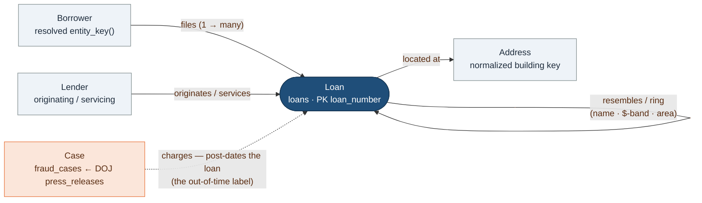

# The ontology — objects and links

relief-probe is small enough to describe as an **ontology**: a handful of object types
and the links between them. Everything the detectors, the graph layer, and the benchmark
do is a walk over this graph. **Loan** is the hub; **Borrower**, **Lender**, **Address**,
and **Case** hang off it.

*A resemblance or a shared address is a **lead for review**, never proof — see
[RESPONSIBLE_USE.md](../RESPONSIBLE_USE.md).*

## Object types

| Object | Backed by | Key | Notes |
| --- | --- | --- | --- |
| **Loan** | `loans` table | `loan_number` | The central fact — one row per PPP loan (SBA FOIA release), ~11.4M rows. Every other object links through it. |
| **Borrower** | derived — `entity_key()` over the loan's business name (+ state) | resolved entity key | Not a physical table: an object *materialized by entity resolution*. The same borrower filing more than once is the **entity** link (a duplicate-funding tell). |
| **Address** | derived — `normalize_address()` over the borrower address | normalized building key | Also materialized, not stored. Loans sharing a building are co-located — the **address** link. |
| **Lender** | attributes on `loans` (`originating_lender`, `servicing_lender_name`) | lender name | The bank/fintech that originated or services the loan. A real lender-risk signal (GAO), and a source of enforcement-selection bias — see [ADR-0004](decisions.md#adr-0004-a-transparent-unsupervised-composite-is-the-default-ranker). |
| **Case** | `fraud_cases` (staged from `press_releases`) | `case_id` → `loan_number` (nullable) | A DOJ/SBA-OIG enforcement action, entity-resolved back to a loan where possible. These are the **PU positives**, and they **post-date** the loan (the out-of-time label). `loan_number` is NULL until resolved. |

## Link types

| Link | From → To | Cardinality | Meaning / where it's used |
| --- | --- | --- | --- |
| **files** (entity) | Borrower → Loan | 1 → many | Same resolved borrower on multiple loans → duplicate-funding lead; the **entity** edge in the ring graph. |
| **originates / services** | Lender → Loan | 1 → many | Which lender's book the loan sits in. A LightGBM feature (and a bias caveat). |
| **located at** (address) | Loan → Address | many → 1 | Shared building → co-location; the **address** edge. (Shared address *alone* validated NULL — legitimate co-location dominates — which is why the graph combines relations.) |
| **resembles** (similarity) | Loan ↔ Loan | many ↔ many | High name + amount-band + same-area look-alikes — re-used shell templates. The **similarity** edge, and the "Similar cases" retrieval tool (**3.4× homophily**). |
| **charges** (label) | Case → Loan | many → 1 | The DOJ charge resolved to a loan. Post-dates the loan by years → the honest out-of-time benchmark. Carries `match_method` + `match_confidence`. |

The **address**, **entity**, and **similarity** links are exactly the three relations the
[multi-relational ring graph](../src/relief_probe/graph/build.py) combines: the bet is that
*combining* relations (plus community detection) separates real rings from benign clustering,
where any single relation alone does not.

## Supporting reference objects

Not part of the core five, but real tables the detectors join against:

| Object | Backed by | Role |
| --- | --- | --- |
| **Establishment** | `establishments` (Census ZIP Business Patterns) | Real establishment count per `(zip, naics)` — the density baseline for `establishment_overcount`. |
| **NAICS title** | `naics_titles` | Industry title per NAICS code — for the name↔industry mismatch detector. |
| **Signal** | `signals` | Detector output contract: `(loan_number, detector_id, score, evidence_json)` — how each object's fraud-risk evidence is recorded. |

*The full column-level schema (and the raw-CSV → warehouse mapping) is the DDL in
[`warehouse/db.py`](../src/relief_probe/warehouse/db.py); the design rationale behind these
choices is in [decisions.md](decisions.md).*
